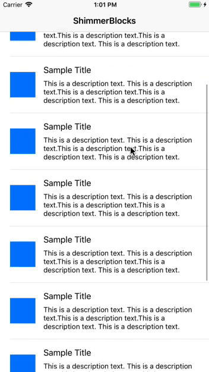

# ShimmerBlocks

Add blocked shimmering views to your view components. 



## Why we built this

Inspiration for this project came from Facebook's [Shimmer](https://github.com/facebook/Shimmer) pod which adds a simple shimmering effect to any view. The shimmer effect is typically seen in loading states in production apps as a blocked view. Facebook's Shimmer pod however doesn't easily allow us to add blocked views to an existing layout. In response to this issue we created ShimmerBlocks to easily add blocked shimmering views to an existing layout.

## Requirements

* iOS 9.0+

## Installation

### CocoaPods

ShimmerBlocks is available through [CocoaPods](http://cocoapods.org). To install
it, simply add the following line to your Podfile:

```ruby
pod 'ShimmerBlocks'
```

## Usage

### 1. Setup the ShimmerContainer

The ShimmerContainer contains all of the ShimmerBlocks for a particular subview.

```swift
public init(parentView: UIView?)
```

The ShimmerContainer should be initialized with the `parentView` that contains the ShimmerContainer. We need the `parentView` to add the shimmerBlocks to. In our example the parent view is a `UITableViewCell`.


```swift
public func applyShimmer(enable: Bool, with shimmerData: [ShimmerData])
```

Shimmering views can start shimmering by passing `enable`, which indicates if the view is shimmering, and the `ShimmerData`.


```swift
public static func generateShimmerView(image: UIImage? = nil, backgroundColor: UIColor)
```

If you just need a singular `ShimmerBlock` a static function is provided to the `ShimmerContainer` that returns a `ShimmerView` with an optional image and the `backgroundColor` of the shimmer.


### 2. Generating ShimmerData

ShimmerData is a model that contains the information on how the shimmer block should be applied to the subview. Below are the adjustable properties that the `ShimmerData` can be initialized with.

```swift
/// View to add shimmer overlay to.
public weak var view: UIView?
```

The `view` the view of the `ShimmerData` is typically a UILabel or UIImage that needs to be blocked during the loading state.


```swift
/// Image to apply to the overlay instead of using a blocked section.
public let image: UIImage?
```

A custom image can be provided to show as a shimmering overlay instead of using the default shimmering block.


```swift
/// Background color of the overlay sections. Does not overlay the image.
public let backgroundColor: UIColor
```

The background color of the shimmer can be customized per block. The default color is `UIColor.lightGray.withAlphaComponent(0.3)` 


```swift
/// Sets the container view size to match the provided view's size.
public let matchViewDimensions: Bool
```

When sizing the height and width of the `ShimmerBlock` setting the `matchViewDimensions` to true will match the `ShimmerBlock` to the size of the given `UIView`.


```swift
/// Spacing between each section.
public let sectionSpacing: CGFloat

/// Sections to display over the provided view.
public let sections: [ShimmerSection]
```

If you need more variety to the size of the `ShimmerBlocks` we give you the option to set your own `ShimmerSections`. The `sectionSpacing` indicates the spacing between each individual section.


### 3. Creating Custom ShimmerSections

```swift
/// Width of the shimmer section.
public let width: CGFloat

/// Height of the shimmer section.
public let height: CGFloat
```

A `ShimmerSection` consists of a width and height that will be used to size the `ShimmerBlock` when the shimmer is applied. Each `ShimmerSection` will correlate to a single `ShimmerBlock`. 


```swift
public static func generate(minWidth: CGFloat,
							              height: CGFloat,
							              totalWidth: CGFloat,
							              maxNumberOfSections: Int) -> [ShimmerSection]
```

To create a more custom look, `ShimmerSections` can be random generated with a few parameters. 

* `minWidth` is the minimum width that a `ShimmerBlock` should be when the size is generated. 

* `height` is the desired height of the `ShimmerBlock`. 

* `totalWidth` is the total width range that the random generator function should try to fill up.

* `maxNumberOfSections` is the maximum number of `ShimmerBlocks` that should be generated within the `totalWidth`. 


### Example Setup

The code below is the `UITableViewCell` this is used in the example project and the animation above.

```swift
import UIKit
import ShimmerBlocks

final class InfoTableViewCell: UITableViewCell {

    @IBOutlet weak var infoImageView: UIImageView!
    @IBOutlet weak var titleLabel: UILabel!
    @IBOutlet weak var descriptionLabel: UILabel!

    private lazy var shimmerContainer = ShimmerContainer(parentView: self)

    private lazy var shimmerData: [ShimmerData] = {
        let titleSections = ShimmerSection.generate(minWidth: 50, 
                                                    height: 21, 
                                                    totalWidth: 150, 
                                                    maxNumberOfSections: 3)
      
        return [ShimmerData(titleLabel, sectionSpacing: 6, sections: titleSections),
                ShimmerData(infoImageView, matchViewDimensions: true),
                ShimmerData(descriptionLabel, matchViewDimensions: true)]
    }()

    func isLoading(_ loading: Bool) {
        shimmerContainer.applyShimmer(enable: loading, with: shimmerData)
    }

}
```

## Contributing to ShimmerBlocks

To report a bug or enhancement request, feel free to file an issue under the respective heading.

If you wish to contribute to the project, fork this repo and submit a pull request. Code contributions should follow the standards specified in the [Prolific Swift Style Guide](https://github.com/prolificinteractive/swift-style-guide).

## License


Copyright (c) 2017 Prolific Interactive

ShimmerBlocks is maintained and sponsored by Prolific Interactive. It may be redistributed under the terms specified in the [LICENSE] file.

[LICENSE]: ./LICENSE
